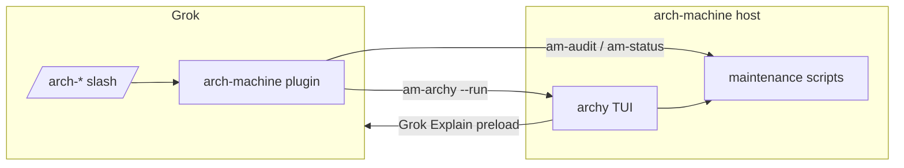

# Grok plugin ↔ archy (cyclic operator loop)

Two surfaces, one host project. They **call each other** on purpose.

```text
┌─────────────────────┐         slash / agent         ┌──────────────────────┐
│  Grok Build (TUI)   │ ── /arch-status, /arch-audit ─►│  arch-machine repo   │
│  + arch-machine     │ ── /arch-control --run ───────►│  + archy binary      │
│    plugin           │                                │  + maintenance/*     │
└─────────▲───────────┘                                └──────────┬───────────┘
          │                                                       │
          │   G / p / Enter brief: suspend +                     │
          │   grok --cwd ROOT "<preloaded prompt>"               │
          └───────────────────────────────────────────────────────┘
```

| Direction | What you do | What runs |
|-----------|-------------|-----------|
| **Grok → arch-machine** | Slash commands or agent skill | Plugin `bin/am-*` → repo scripts / **archy** |
| **archy → Grok** | `g` brief, then `G` / `p` / Enter | Interactive **Grok** with preloaded ask + context files |

Neither replaces the other:

- **Plugin** = agent rails, consent, thin install, expand, headless-friendly audit
- **archy** = local loop controller (menu → job → NEXT) on the machine

---

## How to use the plugin (from Grok)

### Install (once)

```bash
# preferred path on this host
grok plugin install "$HOME/Work/personal/plugins/arch-machine" --trust
grok plugin enable arch-machine
```

Or symlink for dev:

```bash
ln -sfn "$HOME/Work/personal/plugins/arch-machine" "$HOME/.grok/plugins/arch-machine"
```

Confirm: `grok plugin list` shows **arch-machine** enabled.

### Day-to-day (inside Grok)

| You want | Type in Grok |
|----------|----------------|
| Is the host wired? | `/arch-status` |
| Core vs expandable map | `/arch-status map` |
| Threat audit (quiet SUMMARY) | `/arch-audit` or `/arch-audit --dry-run` |
| Open/locate control plane | `/arch-control` · `/arch-control --run` |
| Thin install | `/arch-init` then `/arch-init --yes` |
| Pull a module | `/arch-expand security` then `--yes` |

Upstream repo docs: [arch-machine `docs/archy.md`](https://github.com/p10ns11y/arch-machine/blob/sentinel/docs/archy.md)  
(or your checkout: `$ARCH_MACHINE_ROOT/docs/archy.md`).

Env useful for the plugin:

| Variable | Role |
|----------|------|
| `ARCH_MACHINE_ROOT` | Force which checkout to use |
| `GROK_PLUGIN_ROOT` | Set automatically when the plugin runs |

---

## How to use Grok (from archy)

1. Build/run control plane in the repo:

   ```bash
   cargo build --release --manifest-path crates/archy/Cargo.toml
   TINFOIL_ROOT=$PWD ./crates/archy/target/release/archy
   ```

2. Run a job (e.g. **Audit system**).
3. Open co-pilot brief with **`g`** (brief only — not live chat).
4. Launch Grok with preload:
   - **`p`** on NEXT / **Enter** in brief / **`G`** fullscreen
   - archy writes `logs/archy-grok-context.txt` + `logs/archy-grok-prompt.txt`
   - runs: `grok --cwd <root> [--fullscreen] "<composed prompt>"`
5. Exit Grok → return to archy.

With the **arch-machine plugin** enabled, the Grok session can still use `/arch-*` while you discuss findings.

---

## Mental model



**Cyclic by design:** agent drives the machine; machine reopens the agent with job context.
